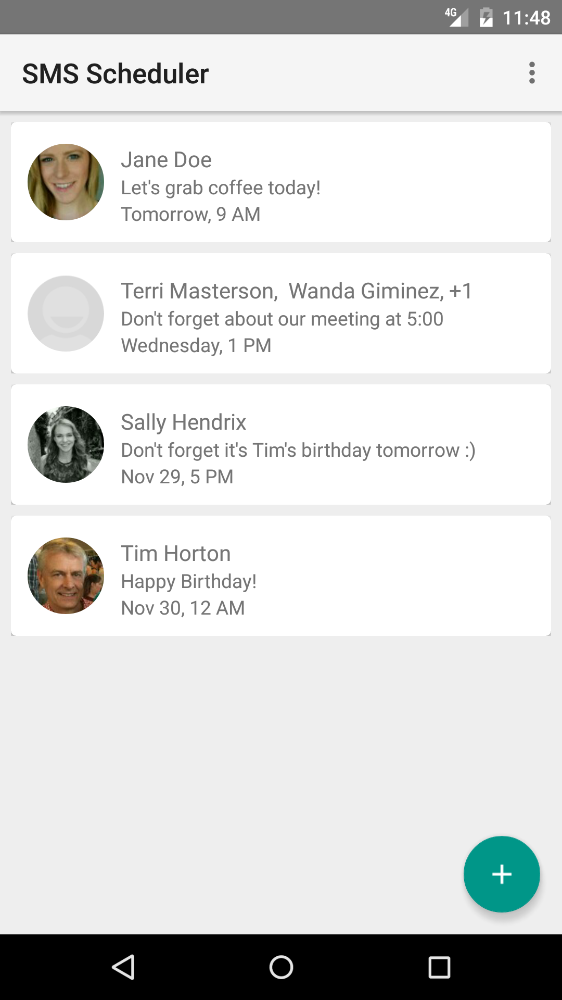
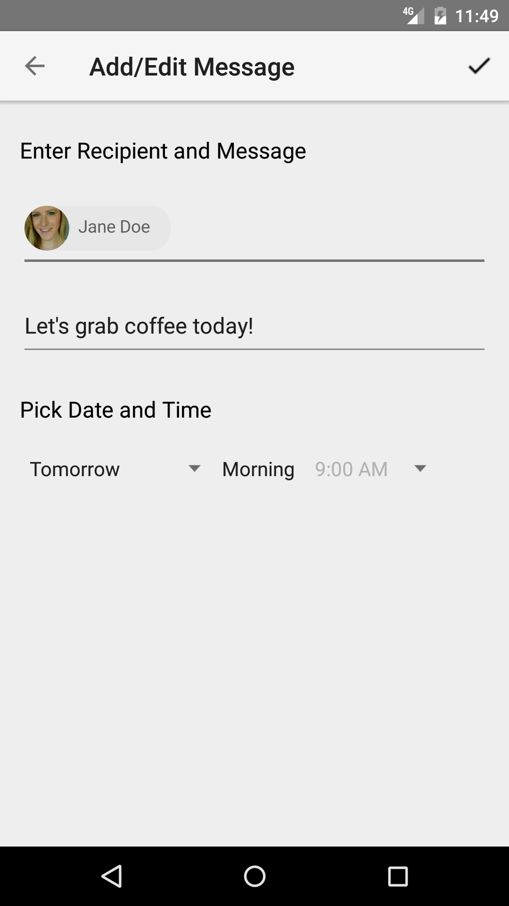
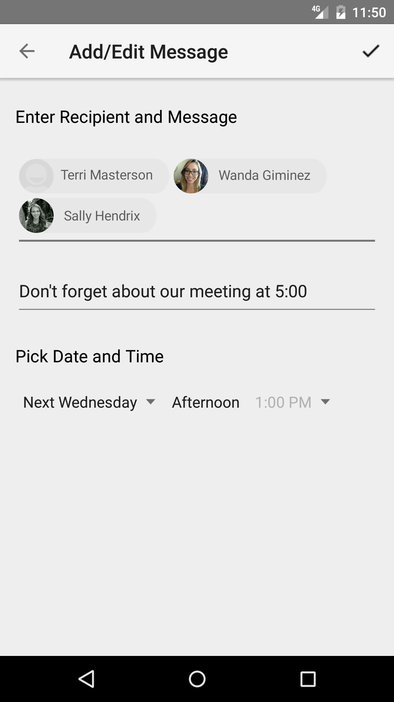

# Material SMS Scheduler
A class project that quickly turned into an obsession and public android app. 
This project has solidified my knowledge of Java and OOP, showed me the results of good and bad design design, and has helped me learn the Android ecosystem as well as features like SQLite, implementing and modifying 3rd party libraries, and much, much more.
[Play Store link](https://play.google.com/store/apps/details?id=com.kyleszombathy.sms_scheduler&hl=en)

## Screenshots

## Project documents
[Final Report Document](https://drive.google.com/file/d/0B4ela-k3pZerYzd0emFLb1VJOVk/view?usp=sharing):  
For the was the culmination of our efforts in CSC 131 at Sac State, we wrote documentation and shared our early vision for the app.

## Privacy Policy
<a href="https://github.com/KtodaZ/Material-SMS-Scheduler/blob/gh-pages/privacyPolicy.md" title="PrivacyPolicy">Privacy Policy</a>
